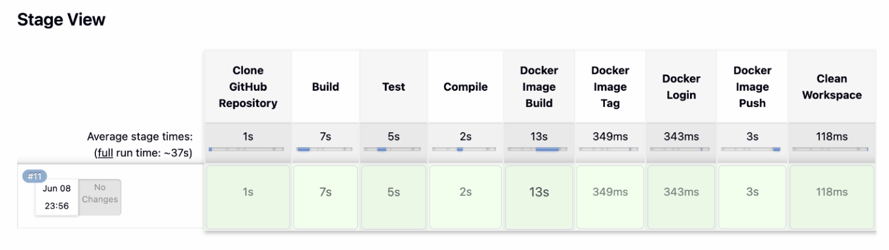

#  Java CI/CD Pipeline using Jenkins, Maven, Docker & Docker Hub

##  Project Overview
This project demonstrates an end-to-end CI/CD pipeline built using **Jenkins**, **Maven**, **Docker**, **Docker Hub**, and **AWS EC2**.

The objective of this project is to automate the complete software delivery process, from source code checkout to Docker image publishing.

---
### Jenkins Stage View



The pipeline automatically:

- Clones source code from GitHub
- Builds the Java application
- Executes test cases
- Compiles source code
- Creates Docker image
- Tags Docker image
- Pushes image to Docker Hub
---

## Project Structure

```text
3-java-jenkins-docker-app/
│
├── Dockerfile
├── Jenkinsfile
├── docker-compose.yml
├── pom.xml
├── README.md
│
├── src/
│   ├── main/java/com/example/App.java
│   └── test/java/com/example/AppTest.java
│
└── screenshots/
    ├── jenkins-stage-view.png
    └── dockerhub-repository.png
```

---

## Jenkins Pipeline Stages

| Stage | Description |
|---------|------------|
| Clone GitHub Repository | Fetch source code from GitHub |
| Build | Build Java application using Maven |
| Test | Execute JUnit test cases |
| Compile | Compile Java source code |
| Docker Image Build | Create Docker image |
| Docker Image Tag | Tag image for Docker Hub |
| Docker Login | Authenticate with Docker Hub |
| Docker Image Push | Push image to Docker Hub |


## Docker Hub Integration

The Docker image generated by Jenkins is automatically pushed to Docker Hub.

### Pull Image

```bash
docker pull krishnakumargv/java-jenkins-docker:latest
```
---

## 🛠️ Build and Run Locally

### Build Application

```bash
mvn clean package
```

### Run Tests

```bash
mvn test
```

### Compile Application

```bash
mvn compile
```

### Run Application

```bash
java -jar target/java-jenkins-docker-1.0-SNAPSHOT.jar
```

Expected Output:

```text
Hello from Java Application for Jenkins CI/CD!
```

---

##  Docker Commands

### Build Docker Image

```bash
docker build -t java-jenkins-docker:latest .
```

### Run Docker Container

```bash
docker run --rm java-jenkins-docker:latest
```

---

##  Challenges Faced and Solutions

### Docker Permission Issue

**Problem**

```bash
permission denied while trying to connect to the docker daemon socket
```

**Solution**

```bash
sudo usermod -aG docker jenkins
sudo systemctl restart jenkins
```

---

### Docker Push Tag Issue

**Problem**

```bash
tag does not exist
```

**Solution**

```bash
docker tag java-jenkins-docker:latest krishnakumargv/java-jenkins-docker:latest
```
## Technologies Used

- Java 17
- Maven
- Jenkins
- Docker
- Docker Hub
- Git & GitHub
- AWS EC2
- Linux (Ubuntu)

---
##  Author

**Venkata Sai Krishna Gudla**

Master's Student – Data Science  
Hochschule Fulda University of Applied Sciences, Germany

GitHub: https://github.com/Im-Krishna-25

---

If you found this project useful, feel free to star the repository.
